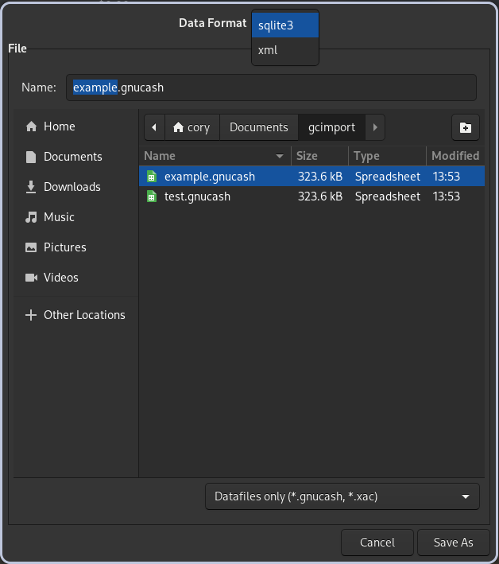

# WIP
This is still very much in beta testing and needs some more testing and pollish.
It works for my particular use case, but is missing some important features such as duplicate checking and support for currencies besides USD. 

# GnuCash-Importer
Uses an hledger style rules file to import csv files into GNUcash

## How to build from source:
```bash
git clone https://github.com/cdrumright/GnuCash-Importer.git
cd GnuCash-Importer
python -m venv .venv/
source .venv/bin/activate 
pip install -r requirements-<your-system>.txt --upgrade
pyinstaller main.spec
./dist/gcimport
```

## Configuration
### Make sure the gnucash file is saved as a database.
This software uses the [piecash](https://github.com/sdementen/piecash) library to interact with the gnucash file, and piecash requires the file to be saved as a database.
To save the gnucash file as a database:
1. open the file in gnucash
2. select save-as
3. in the drop down menu select sqlite
4. save the file



### Create a rules file
A rules file is needed for the importer to map csv fields and build transactions. The rules file tries to follow the same spec used for the [hledger csv rules files](https://hledger.org/1.42/hledger.html#csv-format). 
There's still a long way to go to implement many of the features in the hledger rules files. The basics are there, such as using an if statement to set specific fields or skip certain lines. There are some examples to start from [here](examples).
The minimum values that need to be set for each row are:
- date
- date-format
- account1
- amount1
- account2
- amount2

The amounts should all add up to 0. You can put a minus sign(-) in front of a variable to negate the value, or enclose it in parenthesis. 
## Usage
use the command followed by 2 inputs the order doesn't matter, as the program checks for the file extension. There should also be a rules file in the same folder as the csv file with the same name, but .rules instead of .csv, such as example.rules

`./gcimport example.csv example.gnucash`

